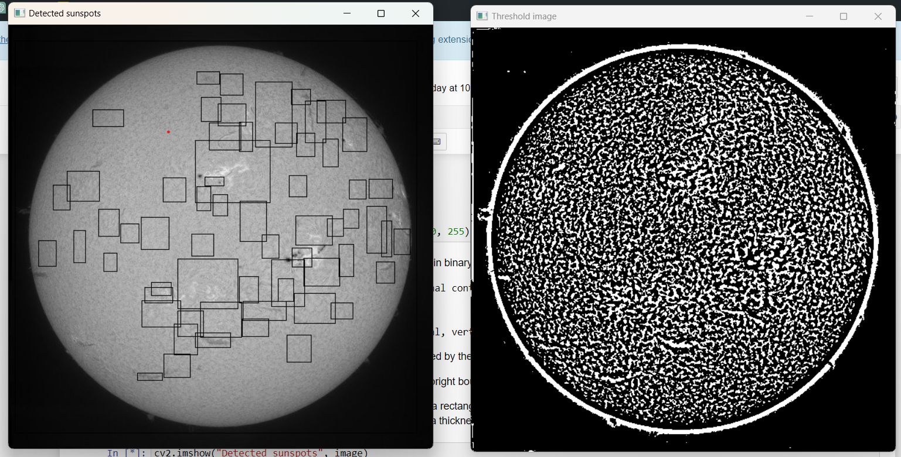

# OpenCV-Project - Sunspot Recognition
This project aims to recognize and visualize sunspots in images using OpenCV and NumPy. The process involves several steps, from loading the image to filtering contours and visualizing the results.

## Project Overview
The sunspot recognition process includes the following key steps:

1. Import Libraries: Import the necessary libraries, including OpenCV and NumPy.
2. Load Image: Load the target image in grayscale mode to simplify processing while retaining essential details.
3. Adaptive Thresholding: Convert the grayscale image into a binary image using adaptive thresholding, effectively highlighting sunspots against the background.
4. Contour Detection: Identify distinct shapes within the binary image through contour detection, with sunspots typically forming contours.
5. Contour Filtering: Filter the detected contours based on their area to isolate sunspots from other elements, removing noise and irrelevant shapes.
6. Sunspot Visualization: Draw bounding boxes or circles around the identified sunspots to visually mark their locations and sizes, aiding in further analysis or presentation of the results.

## Usage
This project can be used for various purposes:
1. Astronomical Analysis: Analyze sunspot patterns and track their changes over time.
2. Educational Demonstrations: Demonstrate image processing techniques in an educational setting.
3. Research: Support research in solar physics by providing a tool for sunspot detection and visualization.

The project includes the necessary Python code and sample images. 

